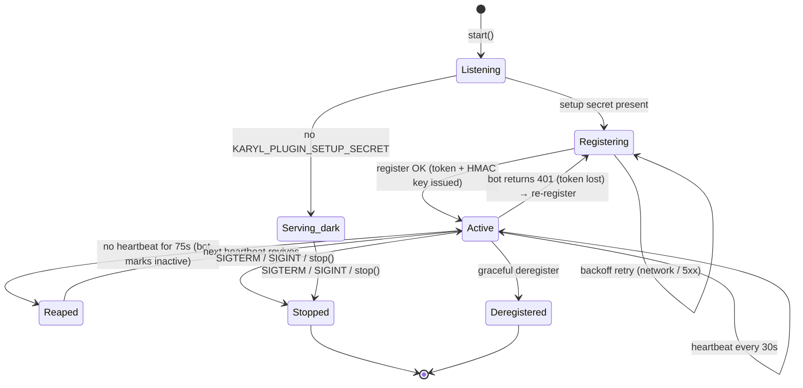

# Plugin lifecycle

How a plugin moves through its runtime states, and what the SDK and bot do
at each transition. This is the state-machine view; the main README's
[Lifecycle](../README.md#lifecycle) lists the concrete steps `start()`
performs.

## State diagram

## States

| State | Meaning |
|-------|---------|
| **Listening** | HTTP server up (`onReady` ran). SDK routes mounted. |
| **Serving dark** | Listening but never registered — `KARYL_PLUGIN_SETUP_SECRET` unset. Useful while building the HTTP surface; the bot doesn't know the plugin exists, so no commands/events flow. |
| **Registering** | Sending the manifest to `POST /api/plugins/register`. Exponential-backoff retry on transient failure. |
| **Active** | Registered. The bot has issued a token (scoped to the approved RPC methods) + a dispatch HMAC key, synced commands to Discord, and routes events/interactions here. `onStart(ctx)` fired once. Heartbeating every ~30 s. |
| **Reaped** | The bot's reaper marked the plugin inactive after ~75 s with no heartbeat (≈ 2 missed beats). Events stop dispatching. The next successful heartbeat revives it. |
| **Stopped** | Graceful shutdown — `onStop(ctx)` ran, HTTP server + lifecycle client closed. |
| **Deregistered** | The plugin (or an admin) explicitly removed the registration; the bot drops its row, token, and Discord commands. |

## Key transitions

- **start() → Active.** The SDK builds the manifest (auto-stamps
  `sdk_version`, auto-derives `rpcMethodsUsed`), registers, and on the
  first success fires `onStart(ctx)` with a fully-populated context (token,
  HMAC key, public base URL all available).
- **Token loss → re-register.** If any bot call returns `401` (e.g. the
  bot restarted and lost the in-memory token), the SDK transparently
  re-registers. Handlers don't see this.
- **Heartbeat ↔ reaper.** Heartbeat cadence is ~30 s; the bot's reaper
  timeout is ~75 s, so a single dropped beat never trips it. A reaped
  plugin is not dead — it self-heals on the next beat.
- **Command sync.** Commands reconcile with Discord on register (and when
  an admin toggles a guild feature). This is the bot's job; the plugin
  only declares them.
- **enable / disable.** When an operator toggles a guild feature, the bot
  POSTs `/_kc/lifecycle` and the SDK invokes `onEnable(ctx, guildId)` /
  `onDisable(ctx, guildId)`. This is orthogonal to register/heartbeat —
  the plugin stays Active throughout.

## Idempotency expectations

- **Re-register is normal**, not exceptional (restart, token loss, code
  reload). Make `onStart` idempotent — it can run again after a
  re-register within the same process only if the process restarted;
  within one process it fires once.
- **Heartbeats are fire-and-forget.** Don't hang shutdown waiting on one.
- **Dropped scopes/capabilities are pruned on re-register.** If you remove
  a scope from `rpcMethodsUsed` (or a capability), the bot removes it on
  the next register — see [permissions.md](permissions.md).
